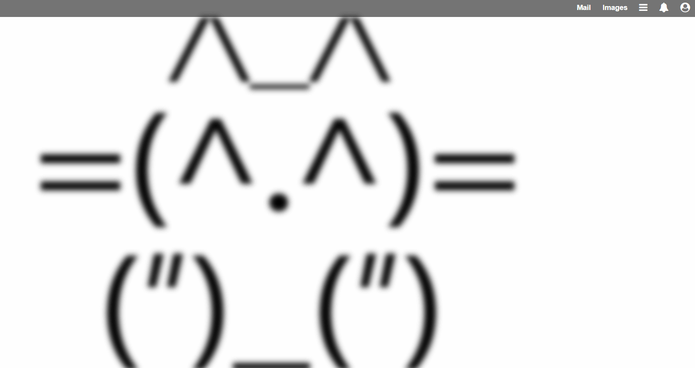
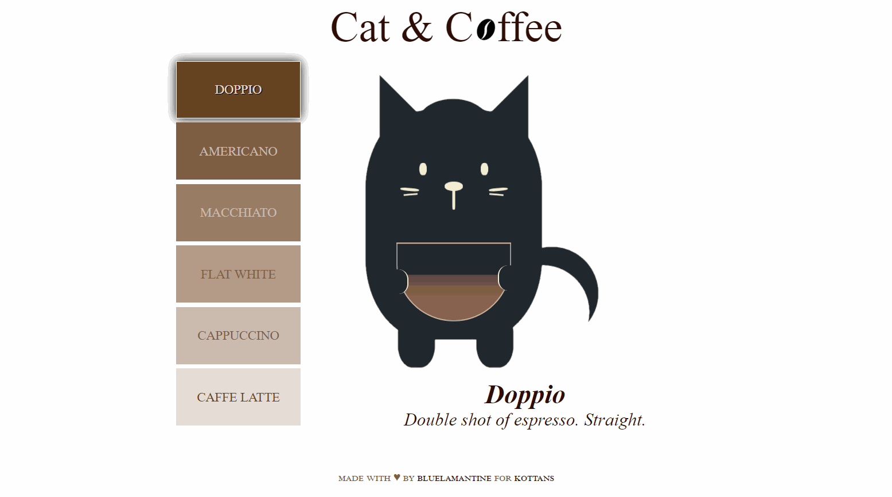

<h1 align="center">KOTTANS-FRONTEDN<br>COURSE</h1>

||<h1>[Kottans. IT community for cats/students/developers](https://kottans.org/)</h1>|
|----- |----- |

|[remote phase](https://github.com/kottans/frontend/tree/master/tasks)| topic | conspect (mindes about learning, short thesis) | sphere | screenshots |
| ----- | ----- |----- |----- |----- |
| [TASK 0](https://github.com/kottans/frontend/blob/master/tasks/git-intro.md) | Git and GitHub | Good tool for tracking changes in computer files and coordinating work with people. <ul><li>First of all introduce yourself to Git ```$ git config --global user.name```</li> <li> Create your repository ```$ git init``` and manage your files ```$ git add file.txt```</li> <li> Look after your files ```$ git status/log/diff/show``` Also be familiar with ```.git``` file</li> <li> Record your changes with  ```$ git commit```</li> <li> Mistakes happen, keep calm and ```$ git reset/rm/revert```</li> <li>Separate your workflow with ```$ git branch``` and ```$ git rebase``` The relation of branches can be shown by ```$ git log --oneline --decorate --graph --all```. If you get lost, you can always be found with ```$ git checkout master```</li></ul> | version control system |[:camera:](task_git_intro/README.md)|
| |
| [TASK 1](https://github.com/kottans/frontend/blob/master/tasks/linux-cli-http.md) | Linux, Command Line, HTTP Tools | Linux is case-sensitive! <ul>Useful commands to <li>list the contents of your current directory ```$ li```</li><li>create a directory ```$ mkdir```</li><li>remove an empty directory ```$ rmdir```</li><li>rename file/to move a file ```$ mv```</li><li>change directories ```$ cd```</li><li>show where you are in the directory structure ```$ pwd```</li><li>display the contents of a file ```$ more```</li><li>copy file ```$ cp```</li><li>remove the file ```$ rm```</li><li>change mode of file (rwx) ```$ chmod```</li><li>see a disk usage listing ```$ df```</li><li>list all processes ```$ps aux```</li><li>kill the process ```$ kill ID-process```</li></ul> NOTE!<br> [HTTP: The Protocol Every Web Developer Must Know - Part 1](https://code.tutsplus.com/tutorials/http-the-protocol-every-web-developer-must-know-part-1--net-31177) <br> [HTTP: The Protocol Every Web Developer Must Know - Part 2](https://code.tutsplus.com/tutorials/http-the-protocol-every-web-developer-must-know-part-2--net-31155)| operation system |[:camera:](task_linux_cli/README.md)  | operation system |[:camera:](#) |
| |
| [TASK 2](https://github.com/kottans/frontend/blob/master/tasks/git-collaboration.md) | Git for Team Collaboration | Important thing - to collaborate with others developers using Github. And the remote repository is the solution! So in collaborating you need to create a new branch that has a descriptive name that describes what changes it contains. To manage your remote repo use commands ```$ git remote```, to send changes us ```$ git push``` and to to retrieve ```$ git fetch/pull ``` <ul>----->The git push command takes :<li>the shortname of the remote repository you want to send commits to </li> <li>the name of the branch that has the commits you want to send</li></ul><ul>----->When git pull is run, the following things happen : <li>the commit(s) on the remote branch are copied to the local repository</li> <li>the local tracking branch (origin/master) is moved to point to the most recent commit</li> <li>the local tracking branch (origin/master) is merged into the local branch (master)</li></ul> <ul>-----> When git fetch is run, the following things happen : <li>he commit(s) on the remote branch are copied to the local repository</li><li>the local tracking branch (e.g. origin/master) is moved to point to the most recent commit</li></ul>| web hosting service |[:camera:](task_git_collaboration/README.md) |
| |
| ||  | | |
| |
| [TASK 3](https://github.com/kottans/frontend/blob/master/tasks/html-css-intro.md) | Intro to HTML and CSS | Hypertext Markup Language (HTML) is the standard markup language for documents designed to be displayed in a web browser.  HTML describes the structure of a web page semantically with HTML tags ```<tag></tag>```, brick by brick. <br>---> I can always refer to [MDN references](https://developer.mozilla.org/en-US/docs/Web/HTML/Element) to get unstuck (as needed)<br><ul> <li><strong>HTML5</strong> &#8211; HTML5 and it&#8217;s new elements make for the most beautiful HTML yet.</li> <li><strong>DOCTYPE</strong> &#8211; HTML5 has the best DOCTYPE ever</li> <li><strong>Indentation</strong> &#8211; Code is indented to show parent/child relationships and emphasize hierarchy.</li> <li><strong>Charset</strong> &#8211; Declared as first thing in the head, before any content.</li> <li><strong>Title</strong> &#8211; Title of the site is simple and clean. Purpose of page is first, a separator is used, and ends with title of the site.</li> <li><strong>Body</strong> &#8211; ID applied to body to allow for unique page styling without any additional markup.</li> <li><strong>File Paths</strong> &#8211; Site resources use relative file paths for efficiency. Content file paths are absolute, assuming content is syndicated.</li> <li><strong>Image Attributes</strong> &#8211; Images include alternate text, mostly for visually impaired uses but also for validation. Height and width applied for rendering efficiency.</li> <li><strong>Main Content First</strong> &#8211; The main content of the page comes after basic identity and navigation but before any ancillary content like sidebar material.</li> <li><strong>Appropriate Descriptive Block-Level Elements</strong> &#8211; Header, Nav, Section, Article, Aside&#8230; all appropriately describe the content they contain better than the divs of old.</li> <li><strong>Hierarchy</strong> &#8211; Title tags are reserved for real content, and follow a clear hierarchy.</li> <li><strong>Appropriate Descriptive Tags</strong> &#8211; Lists are marked up as lists, depending on the needs of the list: unordered, ordered, and the underused definition list.</li> <li><strong>Common Content Included</strong> &#8211; Things common across multiple pages are inserted via server side includes (via whatever method, language, or CMS that works for you)</li> <li><strong>Semantic Classes</strong> &#8211; Beyond appropriate element names, classes and IDs are semantic: they describe without specifying. (e.g. &#8220;col&#8221; is much better than &#8220;left&#8221;)</li> <li><strong>Classes</strong> &#8211; Are used any time similar styling needs to be applied to multiple elements.</li> <li><strong>IDs</strong> &#8211; Are used any time an element appears only once on the page and cannot be targeted reasonably any other way. </li> <li><strong>Dynamic Elements</strong> &#8211; Things that need to be dynamic, are dynamic.</li> <li><strong>Characters Encoded</strong> &#8211; If it&#8217;s a special character, it&#8217;s encoded.</li> <li><strong>Free From Styling</strong> &#8211; Nothing on the page applies styling or even implies what the styling might be. Everything on the page is either a required site resource, content, or describing content.</li> <li><strong>Comments</strong> &#8211; Comments are included for things that may not be immediately obvious upon reviewing the code.</li> <li><strong>Valid</strong> &#8211; The code should adhere to W3C guidelines. Tags are closed, required attributes used, nothing deprecated, etc.</li> </ul><br> Cascading Style Sheets (CSS) is a stylesheet language used to describe the presentation of a document written in HTML or XML. CSS describes how elements should be rendered on screen, on paper, in speech, or on other media.<br> ```selector {```<br>```property : value;```<br>```}```<br> ---> For any info about CSS [Mozilla Developer Network - CSS Reference](https://developer.mozilla.org/en-US/docs/Web/CSS/Reference)| markdown |[:camera:](task_html_css_intro/README.md)|
| |
| [TASK 4](https://github.com/kottans/frontend/blob/master/tasks/html-css-responsive.md) | Responsive Web Design | Responsive sites and adaptive sites are the same in that they both change appearance based on the browser environment they are being viewed on (the most common thing: the browser’s width). Responsive design is smooth because the layout fluidly adjusts regardless of what device it is viewed on. <br> There are values in CSS that are for sizing things in relation to the viewport (the size of the browser window). They are called viewport units, and there are a number of them that do slightly different (all useful) things. One unit is 1% of one of the axes of the viewport. These can be useful for responsive design, that is, designing websites that look good across different screen sizes, taking advantage of the space available to them. <br> [A Complete Guide to Flexbox](https://css-tricks.com/snippets/css/a-guide-to-flexbox/)| adaptive design | [:camera:](task_responsive_web_design/README.md)|
| |
| [TASK 5](https://github.com/kottans/frontend/blob/master/tasks/html-css-popup.md) | HTML & CSS practice: Hooli-style Popup |  [DEMO](https://bluelamantine.github.io/kottans-frontend/task_html_css_popup/)| PRACTICE | [:camera:](task_html_css_popup)|
| |
| [TASK 6](https://github.com/kottans/frontend/blob/master/tasks/js-basics.md) | JavaScript Basics | JS is a wonderful and powerful instrument for modern web. We wouldn’t have the dynamic content and usability without JavaScript! In this task I learned JS fundamentals. Working with JS in proposed tasks I able to: <ul><li>understand what Javascript is and explain its use in web development</li> <li>explain and use JavaScript primitive data types and variables</li><li>explain and use JavaScript functions as properties and methods on primitive data types</li> <li>explain global object in JavaScript and be able to use the Math object</li> <li>explain basic control flow and if/else statements</li><li>and more basic knowledges</li></ul>| programming language | [:camera:](task_js_basics/README.md)|
| |
| [TASK 7](https://github.com/kottans/frontend/blob/master/tasks/js-dom.md) | Document Object Model | Working with the DOM is one of the most common tasks of client-side JavaScript. <br> ---> For more info [MDN DOM](https://developer.mozilla.org/ru/docs/DOM/DOM_Reference) <br> We must strive to minimize the operations of accessing the DOM tree : <ul><li>avoid to calls DOM elements inside loops</li><li>to assign references to DOM elements to local variables and work with these variables</li><li>use selector interface where possible</li><li>the value of the length property should be stored in a local variable when iterating through HTML collections</li></ul>  [DEMO](https://bluelamantine.github.io/kottans-frontend/task_js_dom/)| dom / PRACTICE | [:camera:](task_js_dom/screenshots)|
| |
| [TASK 8](https://github.com/kottans/frontend/blob/master/tasks/js-pre-oop.md) | Building a Tiny JS World | This is a [tiny task](https://github.com/OleksiyRudenko/a-tiny-JS-world) for those who are not familiar with Object-Oriented Programing concepts yet. And with JavaScript OOP in particular. | pre-oop / PRACTICE | [:camera:](https://bluelamantine.github.io/a-tiny-JS-world/)|
| |
| ||  | | |
| |
|  [TASK 9](https://github.com/kottans/frontend/blob/master/tasks/js-oop.md) | Object-Oriented JavaScript | JavaScript gives us a built-in mechanism to share data across objects, called the ```prototype chain```. When we access a property on an object, it can fulfill that request by delegating to some other object. We can use that and change our factory function so that each object it creates contains only the data unique to that particular object, and delegate all other property requests to a single, shared object. ALWAYS define methods on the prototype. To define methods use ```YourClass.prototype.yourMethod``` [DEMO](https://bluelamantine.github.io/kottans-nanodegree-arcade-game/)| oop / PRACTICE | [:camera:](task_js_oop/README.md)|
| |
|  [TASK 10](https://github.com/kottans/frontend/blob/master/tasks/js-post-oop.md) | OOP exercise | To create a class, create a constructor function with a ```Name``` and assign it to a variable of the same ```Name``` . In this constructor only define properties using `this.prop` notation.  To create a subclass use ```extand```. In a child class, you use ```super()``` to call its parent's constructor. | oop / PRACTICE | [:camera:](https://github.com/BlueLamantine/a-tiny-JS-world/tree/gh-pages)|
| |
|  [TASK 12](https://github.com/kottans/frontend/blob/master/tasks/memory-pair-game.md) | Memory – Pair Game |  [DEMO](https://bluelamantine.github.io/kottans-memory-pair-game/) [CODE](https://github.com/BlueLamantine/kottans-memory-pair-game) | PRACTICE | [:camera:](https://github.com/BlueLamantine/kottans-memory-pair-game)|
| |
|  [TASK 13](https://github.com/kottans/frontend/blob/master/tasks/friends-app.md) | Community App(Friends App) |[DEMO](https://bluelamantine.github.io/kottans-community-app/) [CODE](https://github.com/BlueLamantine/kottans-community-app) | PRACTICE | [:camera:]()|
| |